# iris-fhir-validation

## Description

This is an example of how to use the validation and profiling capabilities of the IRIS FHIR Repository.

This example is in two parts:

- The first part is a simple FHIR server that can be used to validate resources and profiles.
- The second part is about SearchParams and how to register them in the FHIR Repository.

## Installation

### Prerequisites

- Make sure you have [Docker](https://www.docker.com/) installed and running on your system
- Git makes it easier to download the repository and follow the instructions

### Installation steps

Clone/git pull the repo into any local directory

```sh
git clone https://github.com/grongierisc/iris-fhir-validation
```

Open the terminal in this directory and run:

```sh
docker-compose up
```

## How to Test it

### FHIR Validation and Profiling

This repository contains a simple FHIR server that can be used to validate resources and profiles.

The profiles are stored in the `src/fsh/ExampleIG/fsh-generated/resources` directory.

It can be configured in the `profile.ini` file.

```ini
[Config]
SkipIfNoProfileKEY=1
IGListKEY=/irisdev/app/src/fsh/ExampleIG/fsh-generated/resources/
TerminologyServerKEY=
PatientProfileKEY=
```

* The `SkipIfNoProfileKEY` parameter allows you to skip the validation if no profile is found in the metadata.
  * If the parameter is set to `1`, the validation will be skipped.
  * If the parameter is set to `0`, the validation will be executed.

* The `IGListKEY` parameter allows you to specify the directory where the profiles are located.

* The `TerminologyServerKEY` parameter allows you to specify the terminology server to use for validation.

* The `PatientProfileKEY` parameter allows you to specify the profile to use for validation.
  * Force the validation to use the specified profile.
  * Can be useful if you don't want to use the profile specified in the metadata.

To apply the configuration or reload the definition of the IG, you must restart the server.

```http
GET http://localhost:8083/fhir/r4/$restart
Accept: application/json+fhir
```

This is a special operation that allows you to restart the server.

It's defined in the CapabilityStatement.

```http
GET http://localhost:8083/fhir/r4/metadata
Accept: application/json+fhir
```

response :

```json
{
  "resourceType": "CapabilityStatement",
  "status": "active",
  "date": "2021-05-27T14:00:00+00:00",
  "kind": "instance",
  "software": {
    "name": "IRIS for Health",
    "version": "2023.1"
    },
    ...
    "rest": [
      "mode": "server",
      "resource" : [
        {
          "type": "Account",
          "versioning": "versioned",
          "readHistory": false,
          ...
        },
        ...
      ],
      ...
      "operation": [
        {
          "name": "$restart",
          "definition": {
            "reference": "http://hl7.org/fhir/OperationDefinition/Resource-restart"
          }
        }
      ]
    ]
  }
}
```

### Example of validation

Example of validation of a Patient resource.

```http
POST http://localhost:8083/fhir/r4/Patient/
Content-Type: application/json+fhir
Accept: application/json+fhir
Prefer: return=representation

{
  "resourceType": "Patient",
  "id": "PatientExample",
  "meta": {
    "profile": [
      "http://example.org/StructureDefinition/MyPatient"
    ]
  },
  "extension": [
    {
      "url": "http://example.org/StructureDefinition/birthsex-extension",
      "valueCode": "M"
    },
    {
      "url": "http://isc.demo/fhir/StructureDefinition/patient-FavoriteColor-extension",
      "valueString" : "Blue"
    }
  ],
  "name": [
    {
      "given": [
        "Janette"
      ],
      "family": "Smith"
    }
  ],
  "maritalStatus": {
    "coding": [
      {
        "code": "M",
        "system": "http://terminology.hl7.org/CodeSystem/v3-MaritalStatus",
        "display": "Married"
      }
    ]
  }
}
```

You can execute the validation by calling the `$validate` operation.

For example, this call will validate the resource and return the result.

```http
POST http://localhost:8083/fhir/r4/Patient/$validate
Content-Type: application/json+fhir
Accept: application/json+fhir

{
  "resourceType": "Parameters",
  "parameter": [
    {
      "name": "resource",
      "resource": {
        "resourceType": "Patient",
        "id": "PatientExample",
        "meta": {
          "profile": [
            "http://example.org/StructureDefinition/MyPatient"
          ]
        },
        "extension": [
          {
            "url": "http://example.org/StructureDefinition/birthsex-extension",
            "valueCode": "R"
          },
          {
            "url": "http://isc.demo/fhir/StructureDefinition/patient-FavoriteColor-extension",
            "valueString" : "Blue"
          }
        ],
        "name": [
          {
            "given": [
              "Janette"
            ],
            "family": "Smith"
          }
        ],
        "maritalStatus": {
          "coding": [
            {
              "code": "M",
              "system": "http://terminology.hl7.org/CodeSystem/v3-MaritalStatus",
              "display": "Married"
            }
          ]
        }
      }
    }
  ]
}
```

It must return an error because the `birthsex-extension` extension is not valid.

```json
{
  "resourceType": "OperationOutcome",
  "issue": [
    {
      "severity": "error",
      "code": "code-invalid",
      "diagnostics": "5001",
      "details": {
        "text": "The value provided ('R') is not in the value set 'Birth Sex' (http://example.org/ValueSet/birthsex-valueset|0.1.0), and a code is required from this value set) (error message = Unable to resolve system - value set expansion has multiple matches: [])"
      },
      "expression": [
        "Patient.extension[0].value.ofType(code)"
      ]
    }
  ]
}
```

### Example of adding a new SearchParameter, StructureDefinition, ValueSet, CodeSystem

First refere to the documentation of [here](https://docs.intersystems.com/irisforhealth20231/csp/docbook/DocBook.UI.Page.cls?KEY=HXFHIR_server_customize)

TL;DR

If you want to add a new SearchParameter, StructureDefinition, ValueSet, CodeSystem, you must register your resource in the package manager of the FHIR server.

⚠️ **Warning** : at the root of the project, you must define a `package.json` file.

The minimum content of this file is [doc](https://docs.intersystems.com/irisforhealth20231/csp/docbook/DocBook.UI.Page.cls?KEY=HXFHIR_server_customize#HXFHIR_server_customize_packages_custom):

```json
{
  "name":"myorg.implementation.r4",
  "version":"0.0.1",
  "dependencies": {
    "hl7.fhir.r4.core":"4.0.1"
  }
}
```

Then you can add your resources in the package manager.

For this, you can use the UI of the FHIR server or the API.

#### UI

##### Import a package

1. Make sure the JSON files of the package are on your local machine. If you are importing a published package, download it from the distribution site to your local machine. For additional requirements for a custom package, see Creating Custom Packages.

2. In the Management Portal, navigate to Home > Health > MyFHIRNamespace > FHIR Configuration.

url : http://localhost:8083/csp/sys/UtilHome.csp?$NAMESPACE=FHIRSERVER

Login : SuperUser/SYS

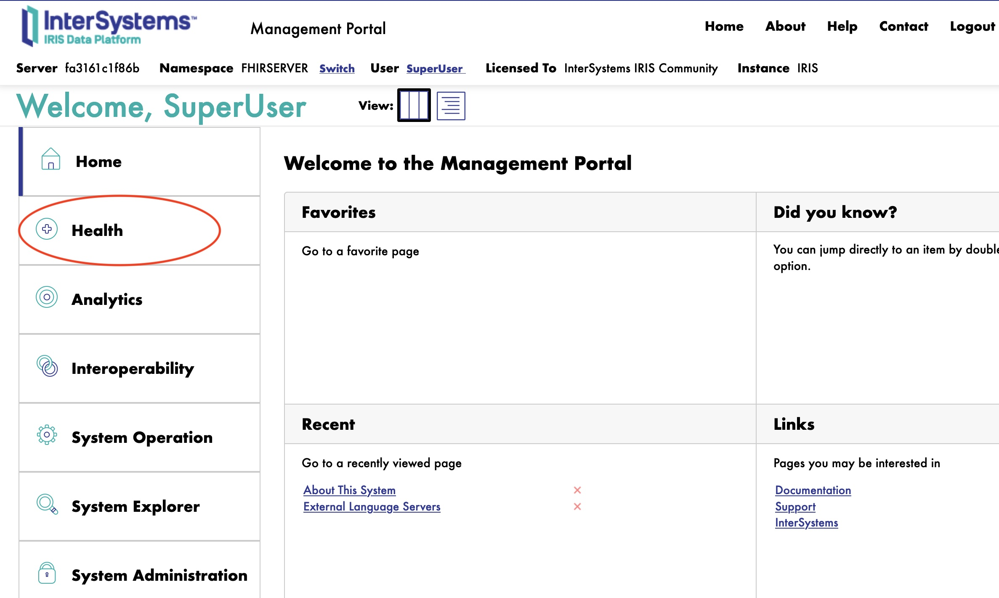
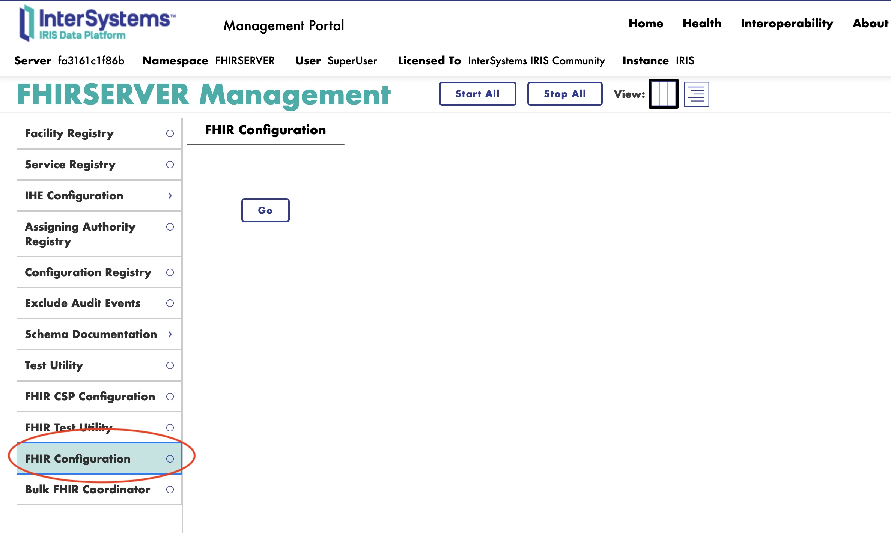

1. Select the Package Configuration card.

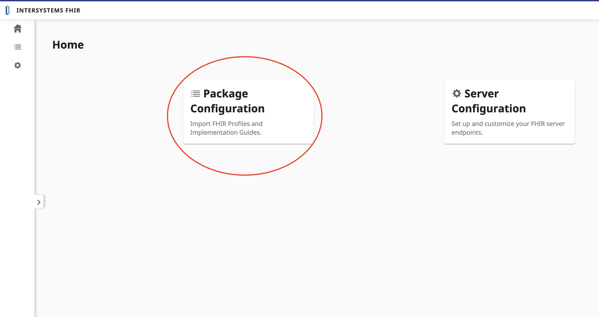

4. Make sure that the dependencies of the new package have already been imported. You can review which packages have been imported by looking at the left hand navigation bar of the Package Configuration page.

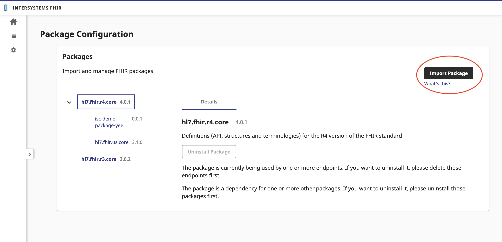

5. Select Import Package.

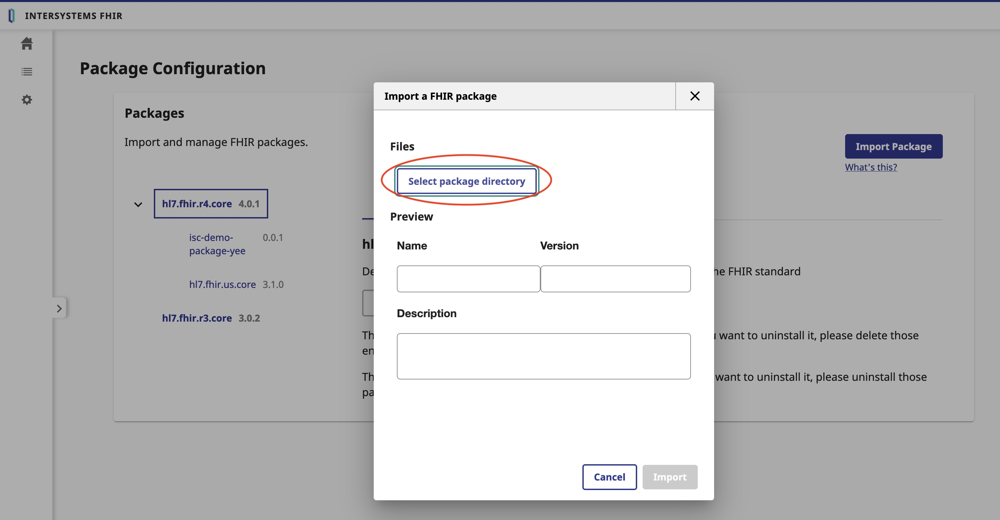

6. Select the directory that contains the package’s JSON files. Do not select the individual files.

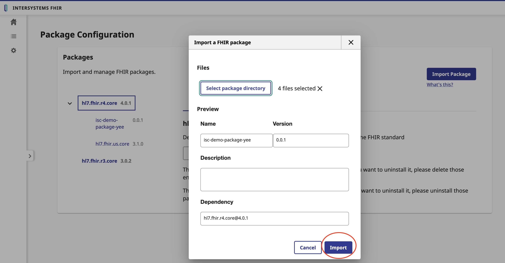

7. Select Import.

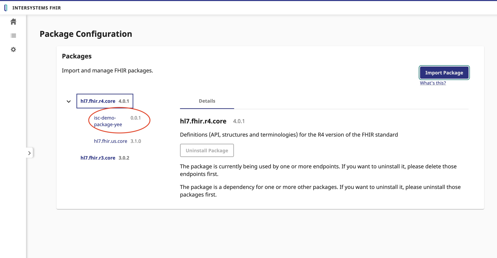


##### Add a package

1. In the Management Portal, navigate to Home > Health > [MyFHIRNamespace] > FHIR Configuration.

url : http://localhost:8083/csp/sys/UtilHome.csp?$NAMESPACE=FHIRSERVER

Login : SuperUser/SYS


2. Select the Server Configuration card.

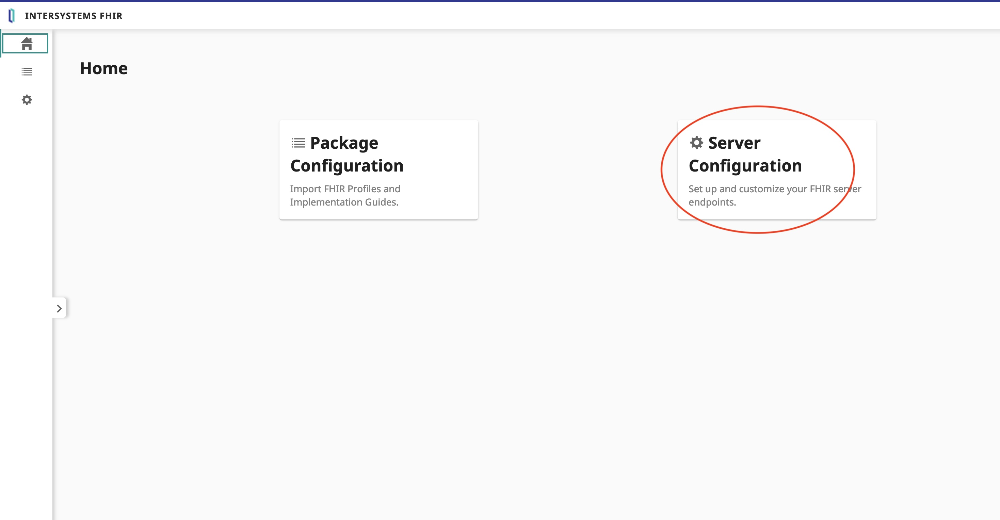

3. Select the endpoint from the list.

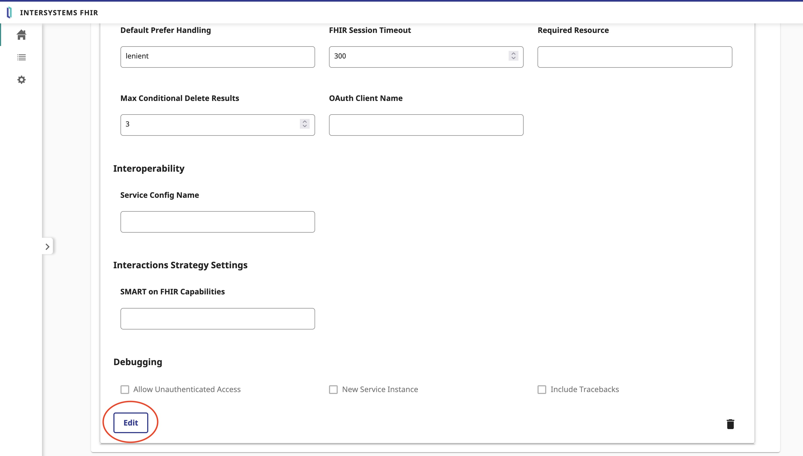

4. Select Edit.

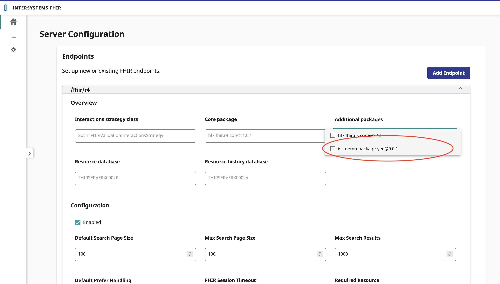

5. Use the Additional Packages drop-down list to select the package. If you do not see the package in the list, make sure you have imported the package.

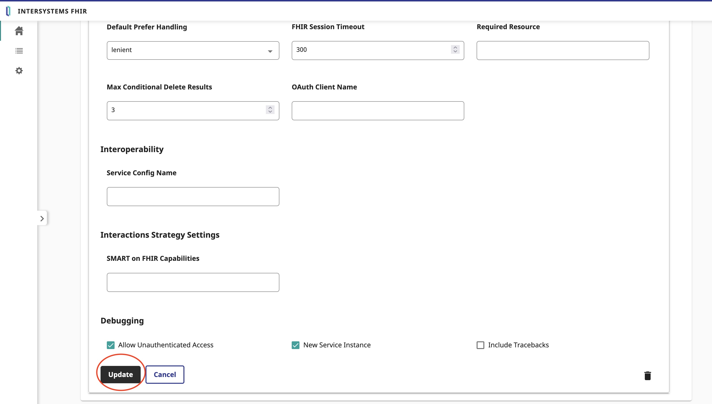

6. Select Update.

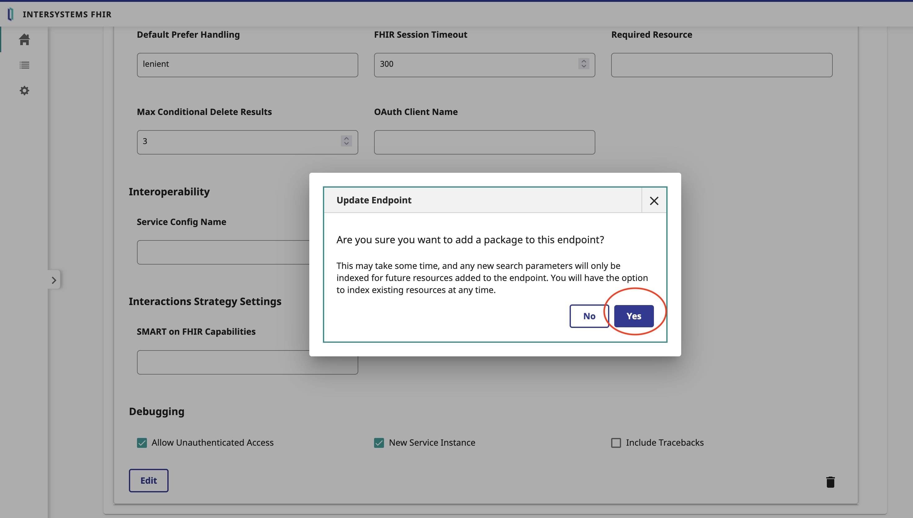
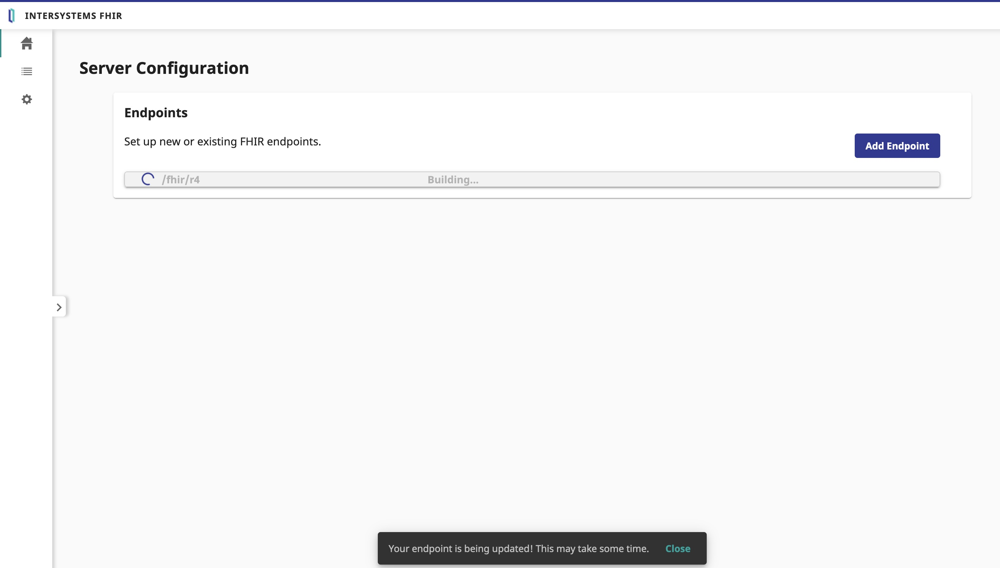

#### API

You can use the python script `profile_helper.py` to add a package to the FHIR server.

⚠️ **Warning** : the shell must be in the container.

```bash
/usr/irissys/bin/irispython /irisdev/app/src/python/profile_helper.py
```
or

```python
>>> import profile_helper
>>> profile_helper.import_package(['/irisdev/app/data/ror'])
Saving hl7.fhir.fr.core@1.1.0
Load Resources: hl7.fhir.fr.core@1.1.0
>>> profile_helper.add_package_to_endpoint('/fhir/ror',['ans.fhir.fr.ror@0.1.1'])
```

##### Example

Same example as above but with the api.

Import the package `isc-demo-package-yee` in the FHIR server.

```bash
/usr/irissys/bin/irispython /irisdev/app/src/python/profile_helper.py --imports /irisdev/app/data/isc-demo-fhir-package
```

Add the package `isc-demo-package-yee` to the endpoint `/fhir/r4`.

```bash
/usr/irissys/bin/irispython /irisdev/app/src/python/profile_helper.py --add /fhir/r4 isc-demo-package-yee@0.0.1
```

Index the resources of the package `isc-demo-package-yee` in the endpoint `/fhir/r4`.

```bash
/usr/irissys/bin/irispython /irisdev/app/src/python/profile_helper.py --index /fhir/r4
```

#### Check the CapabilityStatement

```http
GET http://localhost:8083/fhir/r4/metadata
Accept: application/json+fhir
```

response :

```json
{
  "resourceType": "CapabilityStatement",
  "id": "3a82f9a2-1f2e-11ee-834e-0242c0a8a002",
  "url": "http://localhost:8083/fhir/r4/metadata",
  "version": "1",
  "name": "InterSystems FHIR Server CapabilityStatement",
  "status": "active",
  "experimental": false,
  "date": "2023-07-10",
  "publisher": "InterSystems Corporation",
  ...
  "rest":[
    {
      "mode":"server",
      "resource": [
        ...,
        {
          "type": "Patient",
          "versioning": "versioned",
          "readHistory": false,
          "updateCreate": true,
          "conditionalCreate": true,
          ...
          "searchParam": [
            {
              "name": "FavoriteColor",
              "type": "string"
            },
            ...
          ]
      ]
    }
  ]
}
```

##### Test it

Post a Patient with a FavoriteColor extension

```http
POST http://localhost:8083/fhir/r4/Patient
Content-Type: application/json+fhir
Accept: application/json+fhir

{
  "resourceType": "Patient",
  "extension": [
    {
      "url": "http://isc.demo/fhir/StructureDefinition/patient-FavoriteColor-extension",
      "valueString": "blue"
    }
  ]
}
```

Get the Patient with the FavoriteColor extension

```http
GET http://localhost:8083/fhir/r4/Patient?FavoriteColor=blue
Content-Type: application/json+fhir
Accept: application/json+fhir
```
